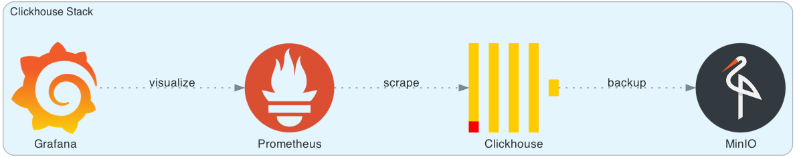

# Production Ready Standalone Clickhouse 🚀

    

    
    

## Table of Contents 🏗️

- [Production Ready Standalone Clickhouse 🚀](#production-ready-standalone-clickhouse-)
  - [Table of Contents 🏗️](#table-of-contents-️)
  - [Project Description 👔](#project-description-)
  - [Project Usage 🚀](#project-usage-)
  - [Contributing 👥](#contributing-)
  - [License 📄](#license-)

## Project Description 👔

This repository contains a Docker Compose file, along with other necessary resources, to set up a production-ready standalone ClickHouse instance. It also includes a monitoring stack composed of Prometheus and Grafana for real-time performance tracking. Additionally, MinIO is incorporated for efficient backup of ClickHouse data. This comprehensive setup ensures a robust and reliable data management environment.

## Project Usage 🚀

1. **Installing the Prerequisites** 🐳: The sole prerequisites for this project are [Docker](https://docs.docker.com/engine/install/) and [Docker Compose](https://docs.docker.com/compose/install/). Please ensure that both are installed on your host machine prior to proceeding.
2. **Setting Environment Variables** 🔐: Create a copy from `.env.sample` with `.env` name on the root directory (using `cp .env.sample .env` command) and replace the placeholder (marked by `<placeholder>`) with the desired value.
3. **Running the Script** 🔧: Execute the `script.sh` command. If it lacks execution permissions, grant them by running the `chmod +x script.sh` command.
4. **Add Grafana Montitoring Plugin for Clickhouse** 📈: 
Install the [Altinity Plugin](https://grafana.com/grafana/plugins/vertamedia-clickhouse-datasource) or you can manually download it in the page and place it in `config_files/grafana/plugins/` directory.
1. Run `docker compose up -d` command.
2. Enjoy!

## Contributing 👥

We welcome contributions to this repository! If you’re interested in contributing, please take a look at our [CONTIRIBUTION.md](https://github.com/mostafaghadimi/clickhouse/blob/master/CONTRIBUTING.md) file for more information on how to get started. We look forward to collaborating with you!

## License 📄

This repository is licensed under the MIT License, which is a permissive open-source license that allows for reuse and modification of the code with few restrictions. You can find the full text of the license in [this](https://github.com/mostafaghadimi/clickhouse/license) file.
